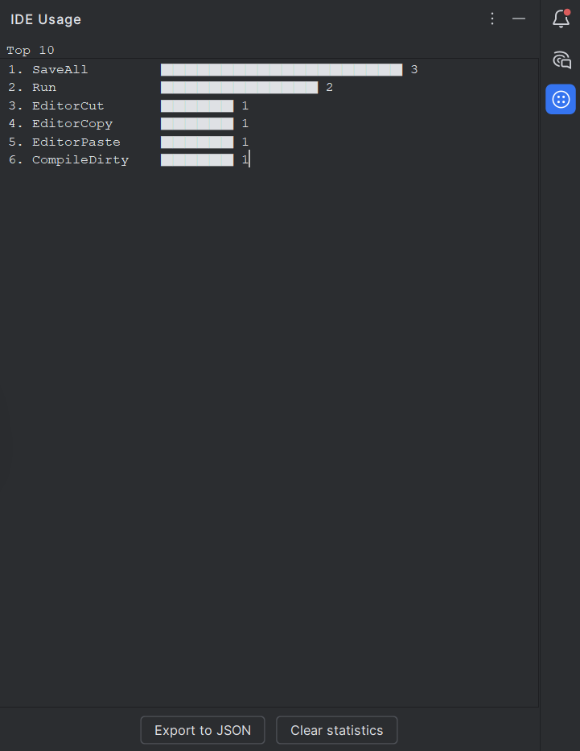
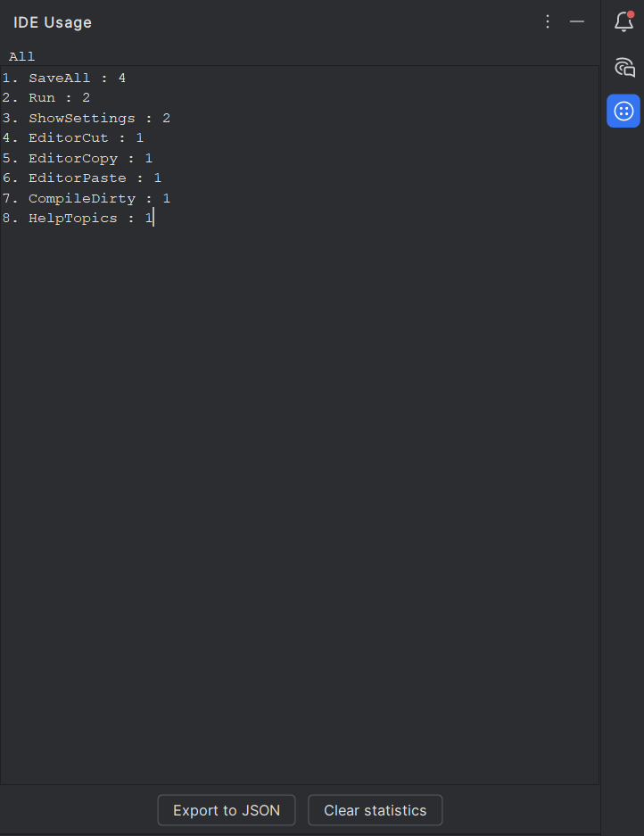
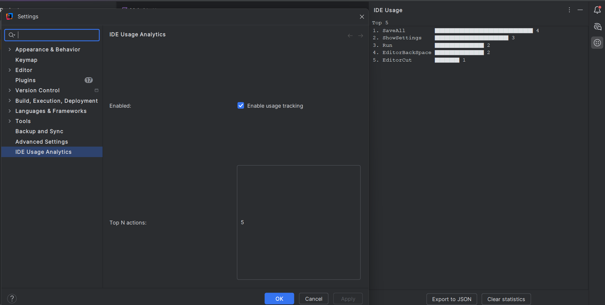

# IDE Usage Analytics

**Local tracking of IntelliJ IDEA actions**

This plugin collects usage statistics of almost all IDE actions, highlights the most frequently used ones, displays them in a Tool Window, and allows exporting the data to JSON. All data is stored locally — nothing is sent externally.

---

## Features

- **Track IDE actions locally**  
  Monitors actions like Run, Build, Save, Reformat, and any other actions performed in the IDE.

- **Persistent storage**  
  Counts are saved between IDE restarts (`usage-analytics.xml`).

- **Tool Window display**  
  View statistics live in a dedicated Tool Window with:  
  - ASCII bar chart proportional to action usage  
  - Ranking numbers (1., 2., 3., …)  
  - Two display modes:  
    - **Top N actions** (configurable in settings)  
    - **All actions**  

- **Clear / Reset**  
  Clear all stored statistics with a single click, either from the Tool Window or via Tools menu.

- **Export to JSON**  
  Save usage statistics to a JSON file for further analysis or personal record.

- **Tools menu actions**  
  Quick access via the **Tools** menu:  
  - **Show Usage Stats** → opens a dialog showing current stats  
  - **Clear Usage Stats** → opens a confirmation dialog to reset counts  

- **Configurable settings**  
  - Set `Top N` actions to display  
  - Optionally ignore certain actions (planned for future versions)

---

## Architecture

- **Action Listener:** Tracks IDE actions and increments counts.  
- **Application Service:** Singleton service storing usage counts and providing an API.  
- **PersistentStateComponent:** Saves counts between IDE restarts.  
- **Tool Window:** Displays live usage stats, supports Top N / All modes, and handles Clear / Export actions.  
- **Tools Menu Actions:** Show or clear usage stats via dialog.  
- **MessageBus:** Updates the Tool Window UI whenever usage data changes.  

---

## Screenshots

  
  
  

